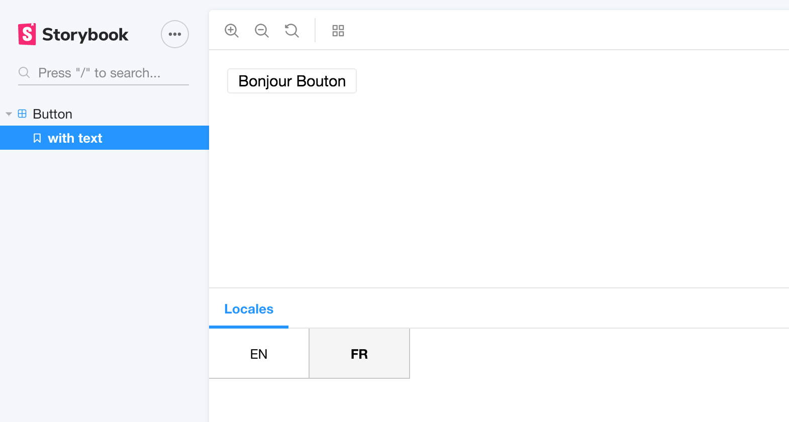

# Lingui react Addon
The linguijs react addon can be used to provide locale switcher and linguijs react.



## Getting Started

First, install the addon

```shell
npm install -D storybook-addon-linguijs
```

_Note: Following peer dependencies are required: `@storybook/addons`, `@storybook/react`, `react` and `lingui/react`._

Add this line to your `addons.js` file (create this file inside your storybook config directory if needed).

```js
import 'storybook-addon-intl/register';
```

In your `config.js` import the `setLinguiConfig` and `withLingui` function. Use `setLinguiConfig` to set the configuration
for `lingui/react` and `withIntl´ as decorator.

```js
import { addDecorator, configure } from '@storybook/react';
import { setIntlConfig, withLingui } from 'storybook-addon-intl';

// Provide a catalog or import and use your existing one
const catalog = {
  "en": {
    messages: {
      "Hello Button": "Hello Button"
    }
  },
  "fr": {
    messages: {
      "Hello Button": "Bonjour Button"
    }
  }
};

// Set configuration
setLinguiConfig({
  locales: [ 'en', 'fr' ],
  defaultLocale: 'en',
  catalogs
});


// Register decorator
addDecorator(withLingui);

// Run storybook
configure(() => require('./stories'), module);
```
